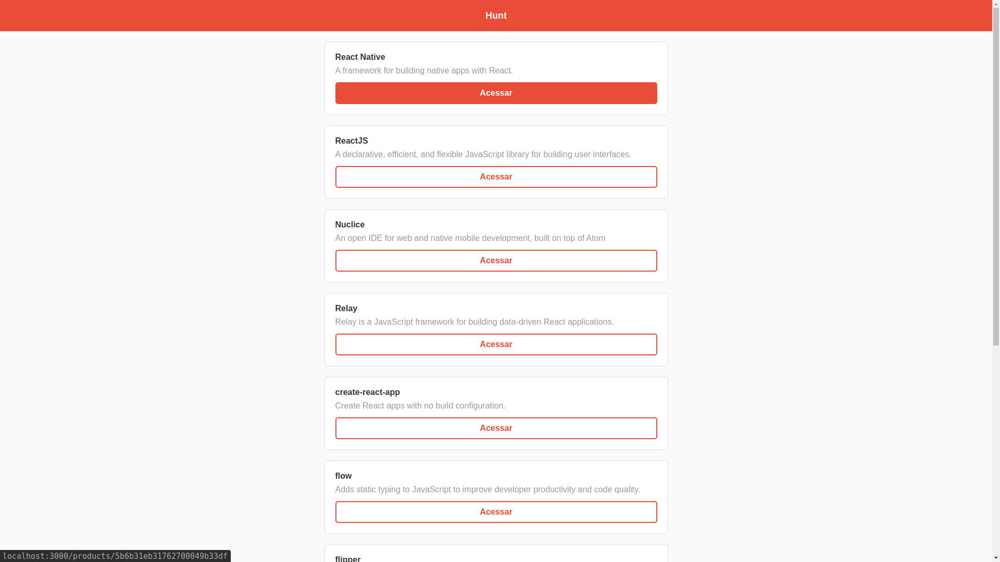
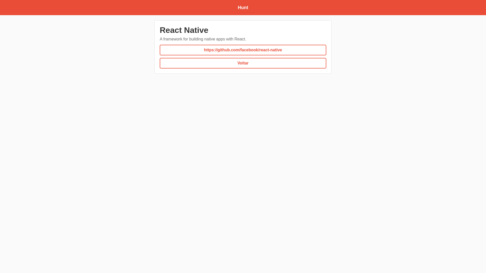
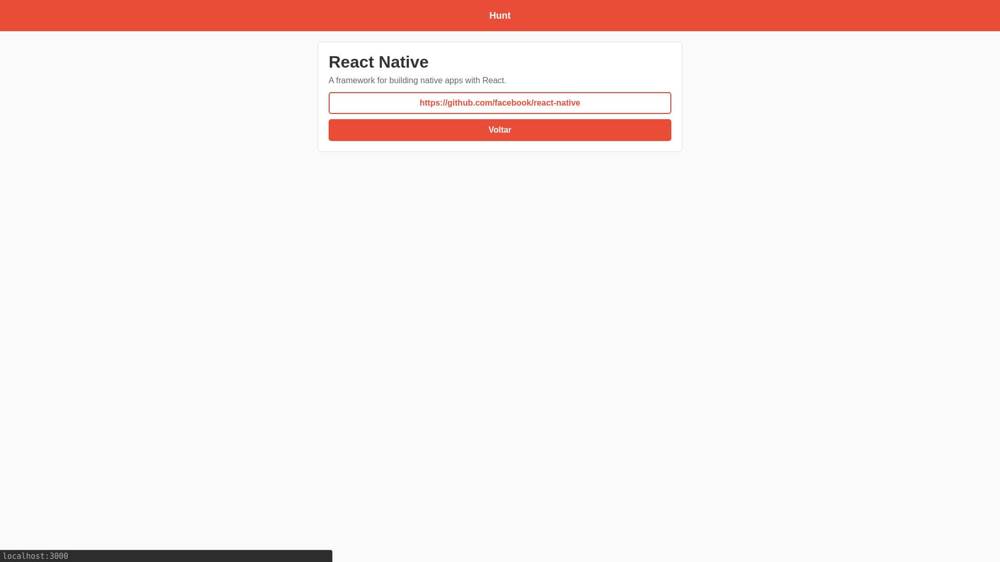
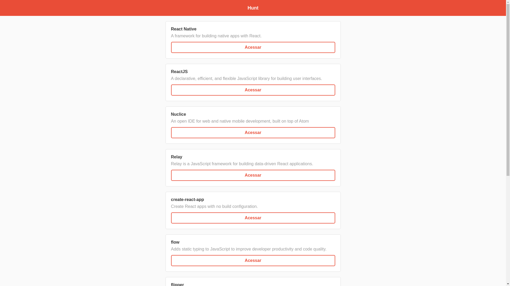
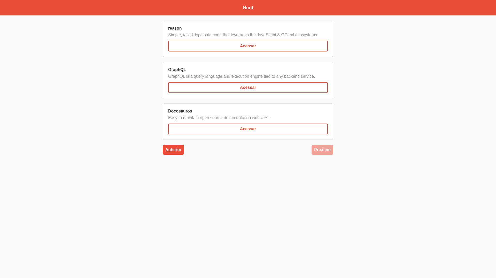

## Hunt Web

Projeto cem react.js:
Consome um api rest para listagem de dados e detalhes de informações dos produtos.

## Instalação
  - Clone o projeto: 
  
    `git clone git@github.com:romulo2735/starter-fullstack-js.git`
    
    `git clone https://github.com/romulo2735/starter-fullstack-js.git`
  - Acesse a pasta do projeto: `cd fullstack-starter-js/web`
  - Execute as dependências: `npm install`
  - Execute o projeto: `npm start` ou `yarn start`

# Imagens

## Pacotes Ultilizados

### [Axios](https://www.npmjs.com/package/axios)
### [React Router Dom](https://reacttraining.com/react-router/web/guides/quick-start)

Para aprender mais sobre React: [React documentation](https://reactjs.org/).
